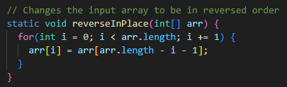
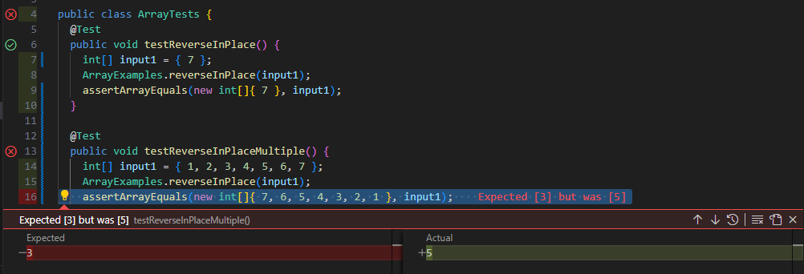

* # Part 1 - Bugs:
  * ## The Buggy Code In Question:
    * 
  * ## My Failure Inducing Input:
    ```
    public void testReverseInPlace() { 
      int[] input1 = { 1, 2, 3, 4, 5, 6, 7 };
      ArrayExamples.reverseInPlace(input1);
      assertArrayEquals(new int[]{ 7, 6, 5, 4, 3, 2, 1 }, input1)
    }
    ```
  * ## My Non-Failure Inducing Input:
    ```
    public void testReverseInPlace() {
      int[] input1 = { 7 };
      ArrayExamples.reverseInPlace(input1);
      assertArrayEquals(new int[]{ 7 }, input1);
	}
    ```
  * ## The Symptom:
   *  
  * ## The Buggy Code and the Fixed Code:
    * Before (Buggy):
      ```
      static void reverseInPlace(int[] arr) {
        for(int i = 0; i < arr.length; i += 1) {
          arr[i] = arr[arr.length - i - 1];
        }
      }
      ```
    * After (Resolved):
      ```
      static void reverseInPlace(int[] arr) {
        int[] temp_array = new int[arr.length];
        for(int i = arr.length - 1, j = 0; i >= 0; i--, j++) {
          temp_array[j] = arr[arr.length - j- 1];
        }

        for (int k = 0; k < arr.length; k++) {
          arr[k] = temp_array[k];
        }
      }
      ```
  * ## Reflection:
    What I did was remake it so that we have two for loops. The job of the first for loop is to store the reverse of the values in our main array, then the second for loop just changes every value inside it to that of the new array. So we return the same loop but with the values reversed. Initially it just iterated through the loop and tried to each value to the value at the opposite end, however that would result in things like:
    `[1, 2, 3, 4, 5]`
    turning into:
    `[1, 2, 3, 2, 1]` 
* # Part 2 - Researching Commands: My Command of Choice - Grep: 
* ## Option One: -o
* This one exclusively prints the parts of a line that are exactly matching with the input parameter. I can imagine if you output this to a `.txt` file and used `-wc` on that you would be able to get the same result (how many lines with this string) but more efficiently, as this would take up less storage. On a small scale its not really worth it but I can imagine it being very useful on a larger scale where memory is more valuable. 
	```
	Alex@DESKTOP-GV4CQHF MINGW64 ~/docsearch/technical/government/Alcohol_Problems (main)
	$ grep -o -n  "alcohol" DraftRecom-PDF.txt
	26:alcohol
	31:alcohol
	35:alcohol
	37:alcohol
        (this goes on for dozens of lines so I stopped it, I will also do this for later grep options.)
	```
	```
	Alex@DESKTOP-GV4CQHF MINGW64 ~/docsearch/technical/government/Media (main)
	$ grep -o -n  "poor" Advocate_for_poor.txt
	12:poor
	16:poor
	```
* ## Option Two: -v
* This one only prints out lines that dont match the parameter. In the context of these documents it isn't very practical. However, if you were searching through a document littered with one specific string you wanted nothing to do with, this would help you weed it out. This can also kind of act as the `!=` operator in java or python or the such. 
	```
	Alex@DESKTOP-GV4CQHF MINGW64 ~/docsearch/technical/government/Alcohol_Problems (main)
	$ grep -v "alcohol" Session2-PDF.txt
	
	
	
	
	Session 2.
	Identifying ED Patients with Alcohol Problems
	
	Robert Woolard, MD
	problems, and they can be identified.1 Research on techniques used
	to identify these patients has been conducted, but several areas of
	```
	```
	Alex@DESKTOP-GV4CQHF MINGW64 ~/docsearch/technical/government/media (main)
	$ grep -v "legal" A_Perk_of_age.txt
	
	
	
	
	A Perk of Age: Free Legal Advice
	By Kelly Greene
	Free Legal advice is only a phone call away - and the hot lines
	that provide it are expanding their services.
	It's a little known perk available to anyone 60 or older: 21
	hot lines for older adults and most take calls from younger
	offices and pro bono or reduced-fee private lawyers. Even if you
	```    
* ## Option Three: -w
* This one will only display matched lines but ignore outputting the file names. I've added a case of using grep without it for clarity. So basically grep will specifically look for a string inside of a file. However, -w makes it so it looks for a whole word rather than just a string. This can be helpful when you're specifically looking for a word in a file rather than an instance of those letters. In a file with `here` and `there`, if we were looking for `here` grep would find both `here` and `there` but with `-w` it would only find `here`.
	```
	Alex@DESKTOP-GV4CQHF MINGW64 ~/docsearch/technical/government/Media (main)
	$ grep -w "poor" Advocate_for_poor.txt
	helping East New York's poor, he's getting booted from the bodega
	helping the working poor navigate the legal system. Immigration,
	```
	```
	Alex@DESKTOP-GV4CQHF MINGW64 ~/docsearch/technical/government/Media (main)
	$ grep -w "po" Advocate_for_poor.txt
	
	Alex@DESKTOP-GV4CQHF MINGW64 ~/docsearch/technical/government/Media (main)
	$ grep "po" Advocate_for_poor.txt
	helping East New York's poor, he's getting booted from the bodega
	helping the working poor navigate the legal system. Immigration,
	Department spokeswoman Carol Abrams said homeownership comes
	```
* ## Option Four: -C n
* This one will print the lines in addition to the proceding lines. If youre scraping documents, this could be helpful in providing some additional context that you otherwise would have had. I used this on the same case I had used with `-o`, and this let me understand what exactly those instances of that word were surrounded by. 
	```
	Alex@DESKTOP-GV4CQHF MINGW64 ~/docsearch/technical/government/Media (main)
	$ grep -C 1 "poor" Advocate_for_poor.txt
	of legal work he'd always dreamed of, but after less than a year of
	helping East New York's poor, he's getting booted from the bodega
	he turned into an office.
	--
	attorney who grew up in East New York, started a nonprofit practice
	helping the working poor navigate the legal system. Immigration,
	landlord-tenant disputes and even criminal cases are the specialty
	```
	```
	Alex@DESKTOP-GV4CQHF MINGW64 ~/docsearch/technical/government/Media (main)
	$ grep -C 1 "legal" agency_expands.txt
	PASADENA -- Neighborhood Legal Services, which provides free
	legal services to the poor, has expanded into the San Gabriel and
	Pomona valleys, areas with large Asian populations, many of whom
	--
	services and programs available to the poor," he said.
	From simple telephone advice to complete legal representation in
	court, the agency provides free consumer, health, family,
	immigration, housing, public benefits and labor legal services to
	people who earn under $1,380 per month.
	--
	"I remember the days when there were only a handful of people in
	the legal offices who spoke Spanish," Dudovitz said. "Now Spanish
	and English are interchangeable. Our goal is to have that for the
	--
	NLS expanded when Legal Services Corp., the federal agency that
	funds providers of free legal services nationwide, reduced the
	number of grantees in the Los Angeles area from five to three,
	```

CITATIONS: 
* https://www.geeksforgeeks.org/grep-command-in-unixlinux/
* I liked this website it was very convenient and simple to understand. It clearly outlined all of the grep options. 
