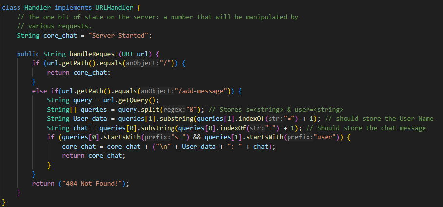
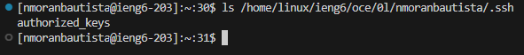
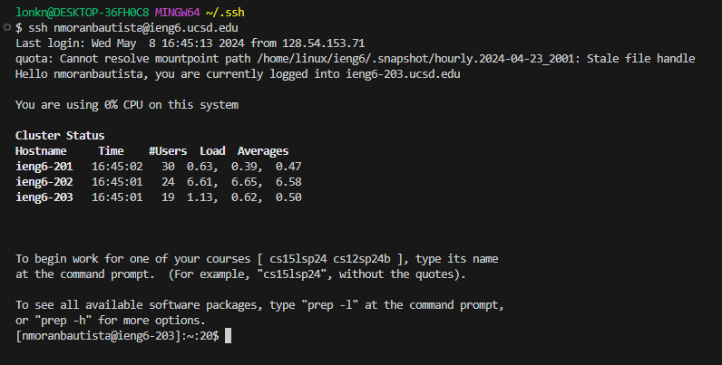

* # Part 1 - Bugs:
  * ## The Buggy Code:
    * 
  * ## My Failure Inducing Input:
    * 
    * 
  * ## My Non-Failure Inducing Input:
    * 
  * ## The Symptom, As The Output of Running The Two Tests Above:
  * ## The Bug
    * Before:
      * 
    * After:
      * 
  * ## Reflection:
    I AM REFLECTING I AM REFLECTING I AM REFLECTING 
* # Part 2 - Researching Commands:
  *  Command of Choice: Grep
  *  
  *  
