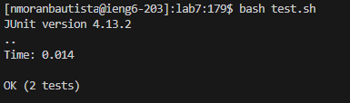

* # Lab Report 4 - The Process
  * ## Step 4 (Four - Log into ieng6)
    * 
    * Key Strokes: `ssh nmoranbautista@ieng6.ucsd.edu` , <`enter`>
  * ## Step Two (Five - Clone your fork of the repository from your Github account (using the SSH URL))
    * 
    * Key Strokes: `git clone ` <`ctrl + v`> <`enter`>
  * ## Step Three (Six - Run the tests, demonstrating that they fail)
    * 
    * Key Strokes:
  * ## Step Four (Seven - Edit the code file to fix the failing test)
    * 
    * Key Strokes: 
  * ## Step Five (Eight - Run the tests, demonstrating that they now succeed)
    * 
    * Key Strokes: 
  * ## Step Six (Nine - Commit and push the resulting change to your Github account (you can pick any commit message!) )
    * 
    * Key Strokes: 
