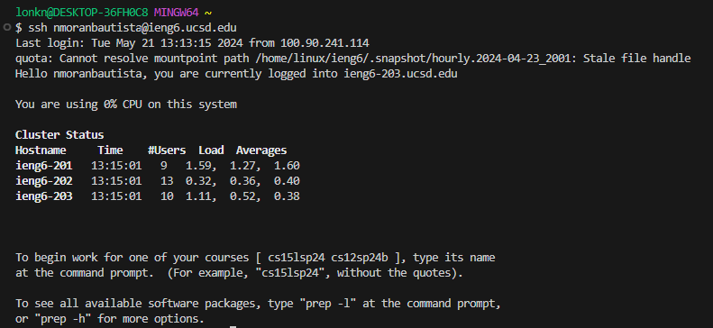
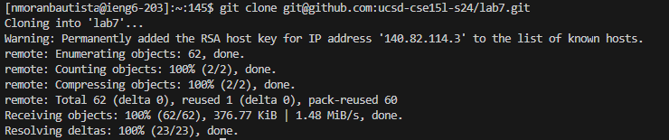
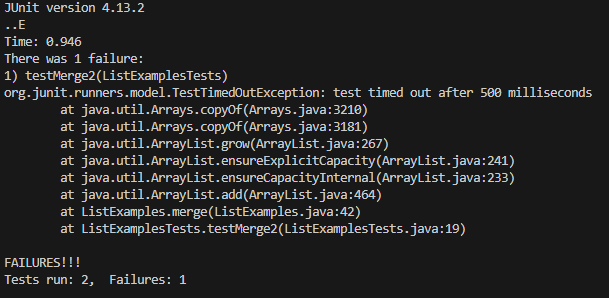
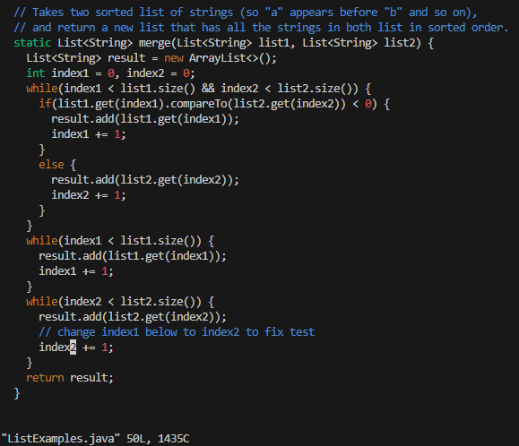
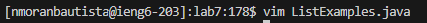
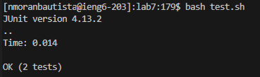
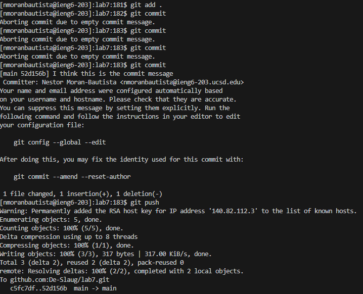
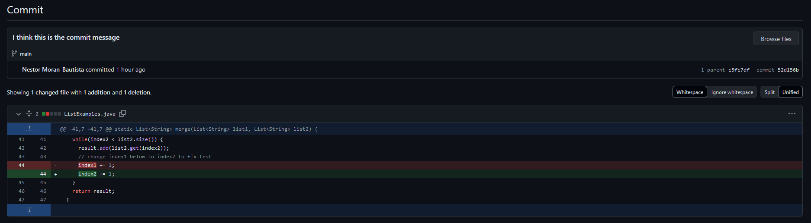

* # Lab Report 4 - The Process
  * ## Step One (Log into ieng6)
    * 
    * Key Strokes: `ssh nmoranbautista@ieng6.ucsd.edu` <`enter`>
    * Summary: This was just using an `SSH` command to log into my ieng6 account. 
  * ## Step Two (Clone your fork of the repository from your Github account (using the SSH URL))
    * 
    * Key Strokes: `git clone ` <`ctrl + v`> <`enter`>
    * Summary: This cloned the `SSH` fork I made in github.  The <`ctrl + v`> was because I had copied the ssh link into my clipboard, this pasted it. 
  * ## Step Three (Run the tests, demonstrating that they fail)
    * 
    * Key Strokes: `cd lab7` <`enter`> `bash test.sh` <`enter`>
    * Summary: I changed directories into the relevant location, then ran a `bash` script which ran a series of tests. 
  * ## Step Four (Edit the code file to fix the failing test)
    * 
    * 
    * Key Strokes:  `vim ListExamples.java` <`enter`> `k` `k` `k` `k` `k` `k` `l` `l` `l` `l` `l` `l` `l` `l` `l` `l` `l` `x` `i` `2`<`Esc`> `:wq` <`enter`>
    * Summary: I used `vim` to open `ListExamples.java` in the `vim` editor. I then used `k` and `l` to maneuver through the text in `ListExamples.java`, `x` got rid of the buggy code, and `i` let me insert the number `2` where it needed to be. Finally `:wq` allowed me to save and exit the `vim` editor.  
  * ## Step Five (Run the tests, demonstrating that they now succeed)
    * 
    * Key Strokes: `bash test.sh` <`enter`>
    * Summary: This was just me rerunning the `bash` script which tested the function. 
  * ## Step Six (Commit and push the resulting change to your Github account (you can pick any commit message!) )
    * 
    * Key Strokes: `git add` <`enter`> `git commit` <`enter`> `i` `I think this is the commit message`<`esc`> `:wq` <`enter`> `git push` <`enter`>
    * Summary: First I used `git add` to tell git what exactly I intend to add to the repository, then I used `git commit` to save all of those things, and finally `git push` to push it all to my actual repository. As seen here:
    * 
