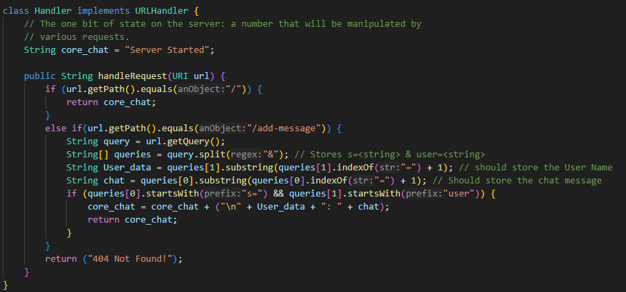
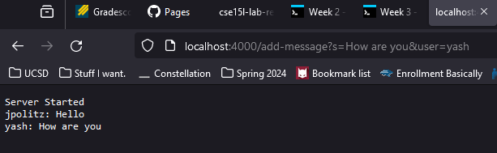
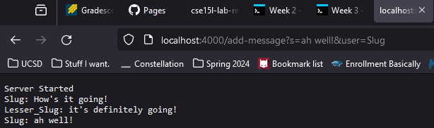
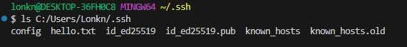
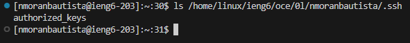
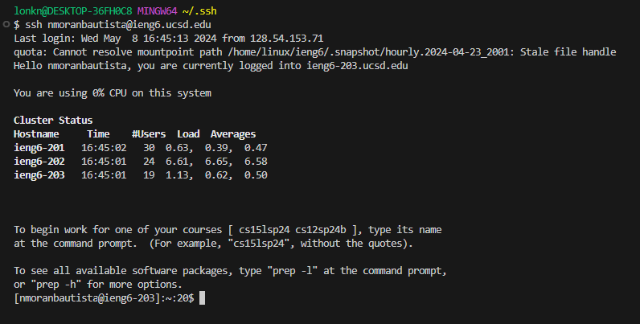

* # Part 1 - Chat Server:
  * ## The Code:
    * 
  * ## `add-message` - Example 1) 
    * 
    * Which methods are called?
      * The only real methods I call throughout the program are: `.equals()`, `.getQuery()`, `.split()`, `.substring()`, `.indexOf`, and `.startsWith()`. I don't make any methods of my own. The general process I went for was getting the query, splitting the query into an array, and using substring to take out my desired values from each of the queries (the username and chat message). Later on in the program, given that the queries contained `s=` and `user`, The main string would be updated to include the new chat and associated user. 
    * The relevant arguments, and the values of relevant fields:
      * For this example the most relevant arguments are `.substring()` and `.indexOf()`, this is because these two methods are what generate the smaller strings and what point out where they begin. These specific methods are what generate what is printed onto the server.. 
    * How are the values of the relevant fields changed in this specific request?
      * In this case they just have the message/username and the respective location of the message/username in the query.  
      For this specific example. My original "Server Started" string was updated to include the subsequent messages. 
  * ## `add-message` - Example 1)
    * 
    * Which methods are called?
      * Largely the same methods as before are called. 
    * The relevant arguments, and the values of relevant fields:
      * The relevant arguments become the values in the `<message>` and the `<user>`. 
    * How are the values of the relevant fields changed in this specific request?
      * All this specific request changes from the last is the username and the actual contents of the message. 
* # Part 2 - SSH;
  *  
  *  
  *  
 
  *  **UPDATE: Since my initial submission I have fixed my problem with still needing a password. I also changed how I ls'd into the path to the private key so that it actually works. I had misunderstood what the prompt was asking.** 

* # Part 3 - Reflection:
  * Prior to this point I actually had a pretty poor understanding of how exactly these locally hosted servers actually functioned. I knew how to maneuver through them and add to their text files and such but I never took the time to understand what the contents of the program was actually saying. Making the chat server forced me to take a closer look into how they worked, like how queries were handled beyond just "change something in the address bar and now its new". I get that its just breaking down strings into components and saving that and then returning that. It's pretty cool. 
