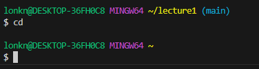
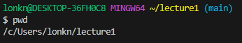
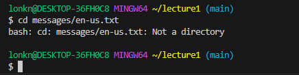
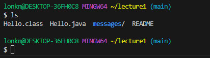
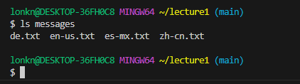
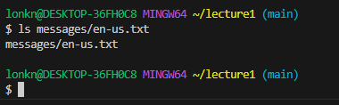
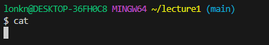
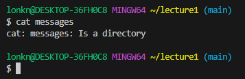
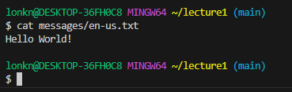

* # cd - Changes the directory.
  * ## A) cd: No Argument
    * 
    * Absolute Path: 
    * Why did I get this output?:
      * ~~`cd` with no argument means to go back to the previous directory, similar to `..`. As such, this command took us back to the directory before `lecture1`, that is. It took us to the home directory In my case: `/c/Users/lonkn/`.~~
      * The reason that my directory was changed to `/c/Users/lonkn/` is that what `cd` with no argument does, is change the current directory to the home directory. In my case my home directory is `/c/Users/lonkn/`.
    * Was it an error?:
      * It was not an error !
  * ## B) cd: To a Directory
    * 
    * Absolute Path: 
    * Why did I get this output?:
      * This one used `cd` in the most practical way. All it did was move us into the desired directory, in this case: `~/lecture1/messages`.
    * Was it an error?:
      * Not an error.
  * ## C) cd: To a file
    * 
    * Absolute Path: 
    * Why did I get this output?:
      * I got this output because the command said to change directories into a file, which is not a directory.
    * Was it an error?:
      * This was an error. `cd messages/en-us.txt` is telling the terminal to change diectories into the file `en-us.txt`, this is an impossible action, and there is no reason for the terminal to be able to resolve this. A text file can not contain a file (at least within the realm of what I know now), so you cannot `cd` inside of it. 

* # ls - Lists the files in a directory.
  * ## A) ls: No Argument
    *  
    * Absolute Path: 
    * Why did I get this output?:
      *  `ls` lists out every item contained within the directory that you are currently in. So the terminal output every item in the `lecture1` folder. 
    * Was it an error?:
      * Nope. 
  * ## B) ls: To a Directory
    *  
    * Absolute Path: 
    * Why did I get this output?:
      * `ls` has the function of listing out every item in whatever is targeted. `ls messages` targeted the directory `messages` which has four text files, `ls` then listed out every file in the messages directory.  
    * Was it an error?:
      * Not at all. 
  * ## C) ls: To a file
    *  
    * Absolute Path: 
    * Why did I get this output?:
      * If `ls` targets a specific file, in this case a text file. It will simply print out the relative directory of the file youre targeting. Since I was in `~/lecture1` it just printed out `messages/en-us.txt`. 
    * Was it an error?:
      * No.

* # cat - Concatenates / merges multiple files and the contents thereof.
  * ## A) cat: No Argument
    *  
    * Absolute Path: 
    * Why did I get this output?:
      * Due to the nature of the `cat` command which I'll explain more in the error section. 
    * Was it an error?:
      * No, however, I do not have a firm grasp of how to use the `cat` command without an argument. A website called: "Linux Handbook" said that it will "read data from its standard input and write them to its standard output". I'm not entirely sure of what this means, but I know `cat` without an argument requires follow up inputs (hence the lack of anything being printed in my screenshot), so this is not necessarily an error. 
  * ## B) cat: To a Directory
    *  
    * Absolute Path: 
    * Why did I get this output?:
      * Because I attempted to use `cat` which concatenates files, on a directory. 
    * Was it an error?:
      * `cat` can merge and print out files to the terminal, because I attempted to use `cat` on a directory, there was nothing to print or merge, so an error was output. 
  * ## C) cat: To a file
    *  
    * Absolute Path: 
    * Why did I get this output?:
      * `cat` has the function of merging and printing files, because I did not specify a second file, there was nothing to merge this file with, so cat just printed out the contents of the file `en-us.txt`
    * Was it an error?:
      * Not an error at all!
