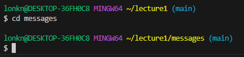

# 1) cd - Changes the directory. 
## A) cd: No Argument
*  
* Absolute Path: 
* Why did I get this output?:
* Was it an error?:
## B) cd: To a Directory
*  
* Absolute Path: 
* Why did I get this output?:
* Was it an error?:
## C) cd: To a file
*  
* Absolute Path: 
* Why did I get this output?:
* Was it an error?:

# 2) ls - Lists the files in a directory.
## A) ls: No Argument
*  
* Absolute Path: 
* Why did I get this output?:
* Was it an error?:
## B) ls: To a Directory
*  
* Absolute Path: 
* Why did I get this output?:
* Was it an error?:
## C) ls: To a file
*  
* Absolute Path: 
* Why did I get this output?:
* Was it an error?:

# 3) cat - Concatenates / merges multiple files and the contents thereof.
## A) cat: No Argument
*  
* Absolute Path: 
* Why did I get this output?:
* Was it an error?:
## B) cat: To a Directory
*  
* Absolute Path: 
* Why did I get this output?:
* Was it an error?:
## C) cat: To a file
*  
* Absolute Path: 
* Why did I get this output?:
* Was it an error?:
